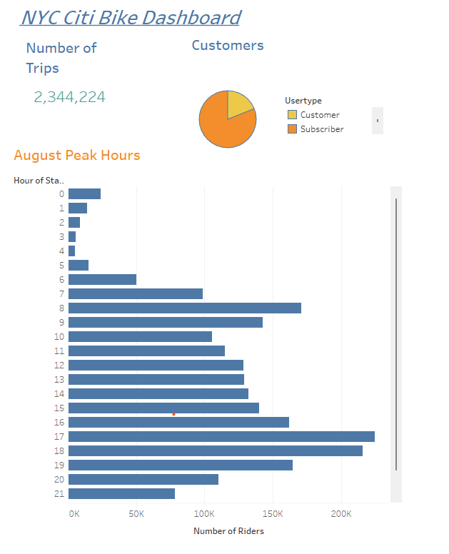
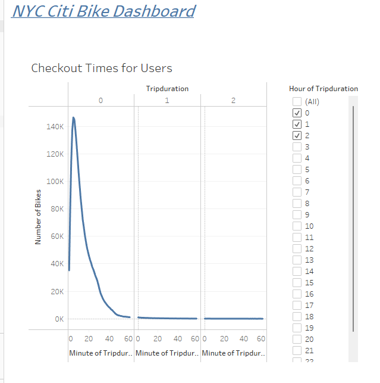
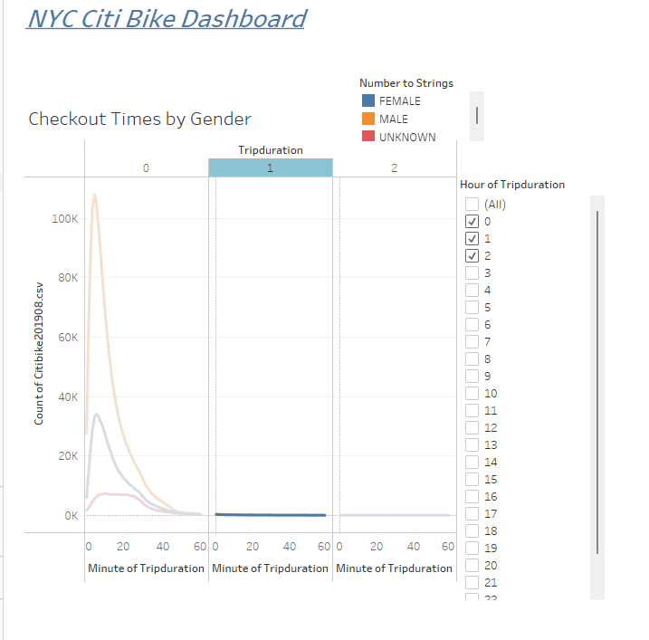
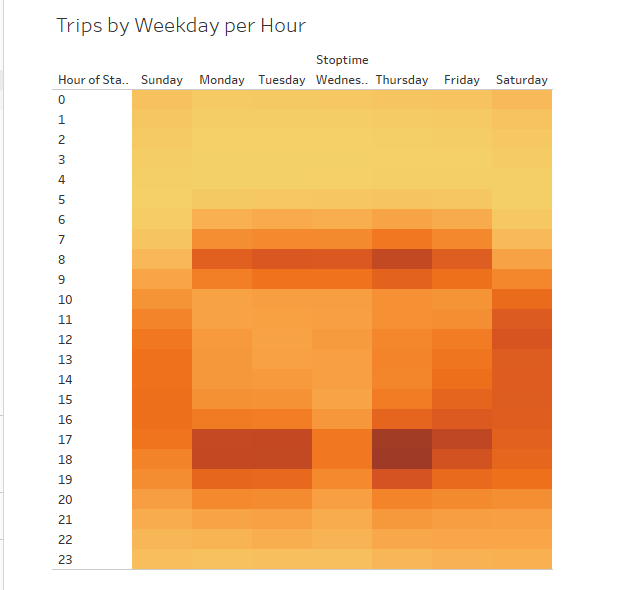
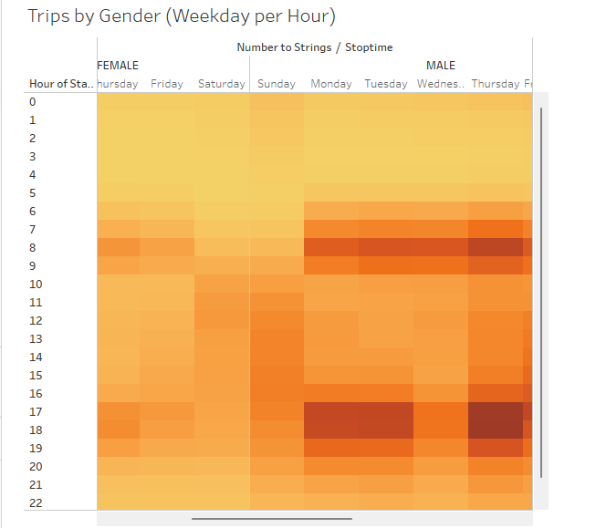
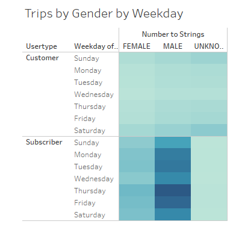

# Bikesharing Data Analysis
## Module 14 Challenge

## Overview

The purpose of this project is to provide visual representations of data for a bikesharing business in New York City (NYC). This data will be used to evaluate potential business options for a bikesharing business in Des Moines, Iowa. Citi Bike is a bikesharing business in NYC.  Data was downloaded from the Citi Bike System Data page for analyzation.  Data for the month of August 2019 was used to run queries on bike rental data and Tableau was used to create visualizations of the data to show to potential investors. 

## Results:

A Tableau Story, with seven data visualizations, was created to display the results and is available at [NYC Citi Bikes Dashboard](https://public.tableau.com/app/profile/maureen.hubka/viz/NYCCityBikes_16483439470900/NYCCitiBikeStory?publish=yes).

The results were as followed: 

- August 2019 data shows that NYC Citi Bikes had over 2 million trips and most riders were subscribers.
- Peak hours were 5pm to 7pm for start of trip.

 

- Checkout Time for Users shows that the vast majority of bikes are checked out only for about 6 minutes, which correlates to the probable needs of subscribers who live in the city and use the bikes for local commuting and errands.

- Checkout times by Gender does not show much difference by gender for the length of time bikes are checked out, only by minutes for each and most were less than 30 minutes for all genders. 

- Trips by Weekday per Hour shows that the busiest times during the week are early mornings and evening, while being later morning and early afternoon on weekends.

- Trips by Gender (Weekday per Hour) did not show much difference by hours for males and females, but unknown genders seem to bike more on weekends.

- Trips by Gender by Weekday shows male and female riders are comparable proportionally and are more likely to be subscribers with higher riding rates mid-week, while unknown gender riders seem more likely not to be subscribers with higher riding rates on weekends.

## Summary:

Since the data shows that most of the riders are subscribers, this would indicate that they are local residents rather than mostly tourists. This theory is also supported by the fact that most of the check out times are during peak commuter times for short intervals of time. More males are subscribers than females, so advertising in Des Moines may want to focus on local males.  Data would need to be cultivated that speaks to how many locals in Des Moines work in the city and how far their commutes are. 

However, the business is supported by non-subscribers during off-peak hours and week-ends, which makes it a viable business that has filler to assist when subcriber usage is lower.  Des Moienes data would also be needed to see if tourists would be able to support this service if local residents can not.

More data visuliztion that can be used to compare business viablity in NYC to Des Moines would be to see how far most trips are and the most popular starting and end points. Comparison of age population can also be looked at to see if similar patterns can be expected in Des Moines.

